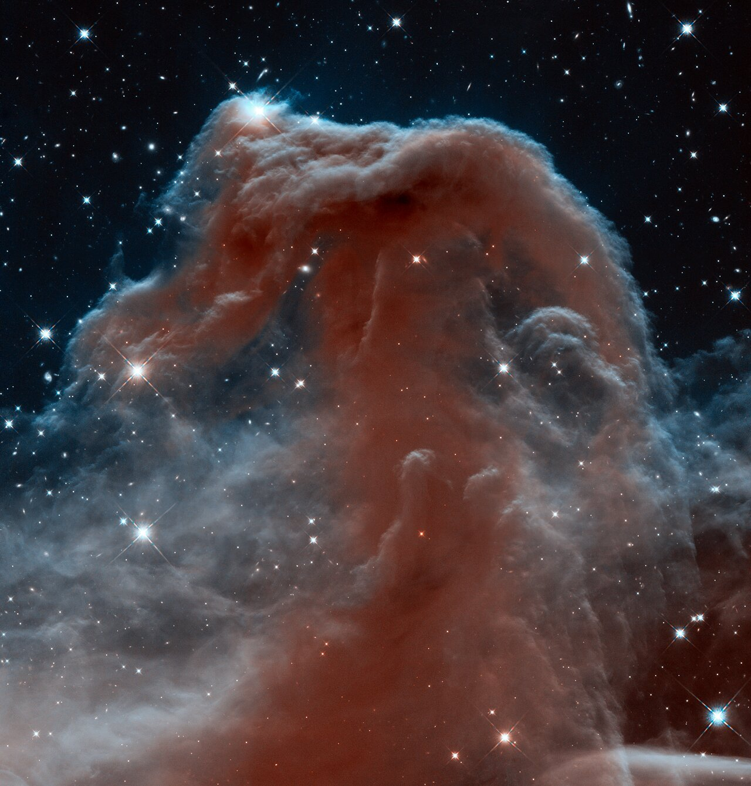
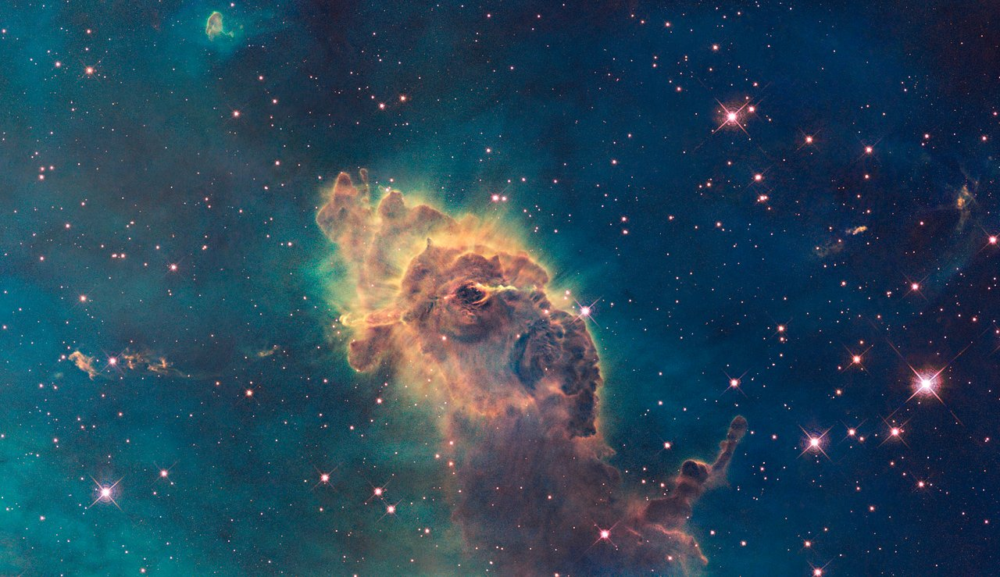
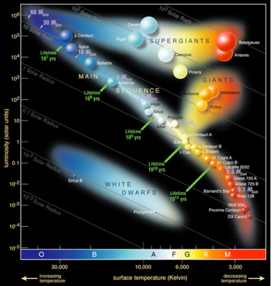

# Module 1 — Classifying stars using data and Python
{: .no_toc }

## Table of contents
{: .no_toc .text-delta }

1. TOC
{:toc}

---

## Who is this for?

This module is for **everyone** curious about astronomy who wants to see how astronomers study stars using **data**.

You do **not** need advanced mathematics — only curiosity and a willingness to try.

*The night sky — every point of light is a star waiting to be classified. Credit: ESA/Hubble*

---

## What this module is about

In textbooks, we often memorize star types such as:

- Main sequence  
- Giants  
- Supergiants  
- White dwarfs  

*A star cluster contains stars of different temperatures and colors — the basis for classification. Credit: ESA/Hubble*

Real astronomers do **not** only memorize labels. They:

- Collect data  
- Plot graphs  
- Look for patterns  
- Draw conclusions  

In this module, **you begin the same kind of thinking**, with Python as a tool for later practice.

---

## What you will learn

By the end of this module, you will be able to:

- Understand what a **Hertzsprung–Russell (HR) Diagram** represents  
- See why **numerical data** matters for star classification  
- Connect theory to **plotting an HR Diagram with Python** (continued in the lab)

*The Hertzsprung–Russell diagram — temperature vs luminosity. Credit: Chandra X-ray Center / NASA*

---

## Key takeaway

Star types are not arbitrary names. They emerge from **patterns in data** — temperature, brightness, and related properties.

When you are ready, continue to Module 2 for the theory that makes the HR Diagram powerful.

[Next: Module 2 — Star classification & HR theory →]({{ site.baseurl }}/module-2/){: .btn .btn-primary }
